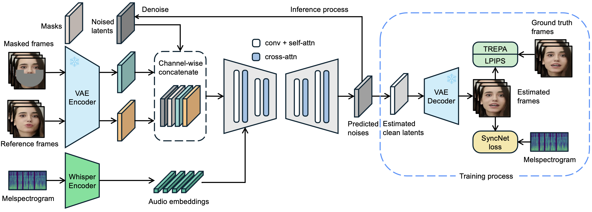

Below is a complete, updated README that documents every step—from environment setup and model downloads to running inference with superresolution (using GFPGAN and CodeFormer) for the LatentSync project. You can copy and paste this updated README into your repository so that anyone (including the hiring team) can reproduce your results.

---

```markdown
# LatentSync: Audio Conditioned Latent Diffusion Models for Lip Sync

<div align="center">

[](https://arxiv.org/abs/2412.09262)
[](https://huggingface.co/spaces/fffiloni/LatentSync)
<a href="https://replicate.com/lucataco/latentsync"></a>

</div>

## 📖 Abstract

We present *LatentSync*, an end-to-end lip sync framework based on audio conditioned latent diffusion models without any intermediate motion representation. Our approach leverages the powerful capabilities of Stable Diffusion to model complex audio-visual correlations directly. Additionally, we introduce *Temporal REPresentation Alignment (TREPA)* to improve temporal consistency across frames. In this update, we also integrate an optional superresolution post‑processing step to enhance the visual quality of the generated lipsync region using GFPGAN and CodeFormer.

## 🏗️ Framework

<p align="center">
  
</p>

LatentSync uses [Whisper](https://github.com/openai/whisper) to convert melspectrograms into audio embeddings. These embeddings are integrated into a U-Net via cross-attention layers. The model uses a one-step approach to predict clean latents from noise and then decodes these latents into frames. TREPA, along with LPIPS and SyncNet losses, is applied to ensure temporal consistency and accurate lip sync.

## 🌟 Superresolution Enhancement (New)

This update adds an optional superresolution step to the inference pipeline. If the generated lipsync subframe is of lower resolution than the original frame, the pipeline automatically upscales that region using either GFPGAN, CodeFormer, or both sequentially. This is controlled via the `--superres` argument with valid options:
- **none** (default): No superresolution is applied.
- **GFPGAN**: Uses GFPGAN for superresolution.
- **CodeFormer**: Uses CodeFormer for superresolution.
- **GFPGAN,CodeFormer**: Applies GFPGAN first and then CodeFormer for maximum quality.

## 🚀 Environment Setup

### Prerequisites
- **WSL2** on Windows or a Linux machine (recommended).
- **Miniconda/Anaconda** installed.
- **FFmpeg** (for video processing).

### 1. Create and Activate the Conda Environment

Open a terminal (WSL2 or Linux) and run:

```bash
conda create -y -n latentsync python=3.10.13
conda activate latentsync
```

### 2. Run the Provided Setup Script

Make sure `setup_env.sh` is executable and run it to install dependencies and download checkpoints:

```bash
chmod +x setup_env.sh
./setup_env.sh
```

This script will:
- Create a new conda environment (if not already created)  
- Install FFmpeg  
- Install Python dependencies from `requirements.txt`  
- Install OpenCV dependencies (via `sudo apt -y install libgl1`)  
- Download all required checkpoints from HuggingFace into the `checkpoints/` directory  
- Create symbolic links for auxiliary models

### 3. Install Additional Dependencies for Superresolution

Install PyTorch, OpenCV, Pillow, and NumPy, and the GFPGAN code:

```bash
pip install torch torchvision numpy opencv-python pillow huggingface_hub
pip install git+https://github.com/TencentARC/GFPGAN.git
```

### 4. Download and Setup CodeFormer

Since CodeFormer isn’t installable via pip, clone its repository manually:

```bash
cd ..
git clone https://github.com/sczhou/CodeFormer.git
cd LatentSync
```

Now, inside the cloned CodeFormer directory (if needed), install its dependencies:

```bash
cd CodeFormer
pip install -r requirements.txt
# (Optional) Install dlib if using dlib-based face detection:
conda install -c conda-forge dlib
# Setup BasicSR, which CodeFormer depends on:
python basicsr/setup.py develop
cd ..
```

The checkpoint file for CodeFormer should be downloaded (if not already) into `checkpoints/CodeFormer.pth`.

---

## 🎬 Inference

### 1. Extract Audio (if needed)

If your video has audio embedded and you need to separate it, use ffmpeg. For example, for a video `demo4.mp4` in the `assets/` folder:

```bash
ffmpeg -i assets/demo4.mp4 -vn -acodec pcm_s16le -ar 16000 assets/demo4_audio.wav
```

### 2. Update and Run the Inference Script

Below is the updated `inference.sh` script. Place it in the repository root:

```bash
#!/bin/bash

# (Optional) Enable swap space if your system runs out of memory
sudo swapon -a

python -m scripts.inference \
    --unet_config_path "configs/unet/second_stage.yaml" \
    --inference_ckpt_path "checkpoints/latentsync_unet.pt" \
    --inference_steps 5 \
    --guidance_scale 0.5 \
    --video_path "assets/demo4.mp4" \
    --audio_path "assets/demo4_audio.wav" \
    --video_out_path "video_out.mp4" \
    --superres GFPGAN,CodeFormer
```

This script will run the lipsync pipeline on `demo4.mp4` using the extracted audio, then apply superresolution to the generated subframe if necessary.

### 3. Running the Inference

From your repository root (with your environment activated), run:

```bash
./inference.sh
```

If your process is killed due to memory issues, consider further reducing `--inference_steps` or lowering `--guidance_scale`, or check your WSL2 resource allocation and swap space.

---

## 📑 How It Works

1. **Lipsync Inference:**  
   The main pipeline (in `scripts/inference.py`) loads the U-Net model, audio encoder, VAE, and scheduler. It processes the input video and audio (demo4.mp4 and demo4_audio.wav) to generate a lipsynced output video and a corresponding mask video (with `_mask.mp4` suffix).

2. **Superresolution Post-Processing:**  
   After inference, the script reads the output video and its mask. It locates the generated region (using the mask) and calculates the resolution ratio. If the generated subframe is lower in resolution, it calls functions from `superres.py` to upscale that region using:
   - **GFPGAN**: Enhances facial details using a GAN-based model.
   - **CodeFormer**: Enhances the generated region with a Transformer-based face restoration method.
   - **GFPGAN,CodeFormer**: Sequentially applies both for enhanced quality.
   The enhanced region is then merged back into the frame, and the final enhanced video is saved.

---

## 🛠️ Helper Module: superres.py

Place this file in the repository root (or in a subfolder such as `utils/` if you update the imports accordingly).

```python
# superres.py
import cv2
import numpy as np
import torch
from PIL import Image

def apply_gfpgan(image, upscale_factor):
    """
    Enhance the image using GFPGAN.
    :param image: NumPy array in BGR format.
    :param upscale_factor: Upscale factor (float).
    :return: Enhanced image as a NumPy array in BGR format.
    """
    from gfpgan import GFPGANer
    model_path = "./checkpoints/GFPGANv1.3.pth"
    gfpganer = GFPGANer(model_path=model_path, upscale=upscale_factor, arch='clean', channel_multiplier=2)
    _, _, restored_img = gfpganer.enhance(image, has_aligned=False, only_center_face=False, paste_back=True)
    return restored_img

def apply_codeformer(image, upscale_factor):
    """
    Enhance the image using CodeFormer.
    :param image: NumPy array in BGR format.
    :param upscale_factor: Upscale factor (float).
    :return: Enhanced image as a NumPy array in BGR format.
    """
    from basicsr.archs.codeformer_arch import CodeFormer
    device = "cuda" if torch.cuda.is_available() else "cpu"
    model = CodeFormer()
    ckpt = torch.load("./checkpoints/CodeFormer.pth", map_location=device)
    model.load_state_dict(ckpt["params_ema"])
    model.to(device)
    model.eval()
    # Convert BGR to RGB
    image_rgb = cv2.cvtColor(image, cv2.COLOR_BGR2RGB)
    tensor = torch.from_numpy(image_rgb).float().div(255.0).permute(2, 0, 1).unsqueeze(0).to(device)
    with torch.no_grad():
        output = model(tensor, w=0.7)[0]
    output = output.clamp(0, 1).permute(1, 2, 0).cpu().numpy()
    output = (output * 255).astype(np.uint8)
    # Convert RGB back to BGR
    output_bgr = cv2.cvtColor(output, cv2.COLOR_RGB2BGR)
    return output_bgr

def apply_superres(image, upscale_factor, method):
    """
    Dispatch to the appropriate superresolution method.
    :param image: NumPy array in BGR format.
    :param upscale_factor: Upscale factor (float).
    :param method: "GFPGAN", "CodeFormer", or "GFPGAN,CodeFormer"
    :return: Enhanced image as a NumPy array in BGR format.
    """
    method = method.lower()
    if method == "gfpgan":
        return apply_gfpgan(image, upscale_factor)
    elif method == "codeformer":
        return apply_codeformer(image, upscale_factor)
    elif method == "gfpgan,codeformer":
        intermediate = apply_gfpgan(image, upscale_factor)
        final = apply_codeformer(intermediate, upscale_factor)
        return final
    else:
        return image
```

---

## 🚀 Running the Pipeline

1. **Extract the Audio (if not already done):**
   ```bash
   ffmpeg -i assets/demo4.mp4 -vn -acodec pcm_s16le -ar 16000 assets/demo4_audio.wav
   ```

2. **Run the Inference Script:**
   ```bash
   ./inference.sh
   ```
   This uses the parameters in `inference.sh` to process `assets/demo4.mp4` and its corresponding audio, apply the lipsync generation, and post-process the video using the superresolution enhancement.

3. **Review the Output:**
   - The final enhanced video will be saved as specified by `--video_out_path` (e.g., `video_out.mp4` or another filename if post‑processing renames it).
   - Play the video using a media player (VLC, ffplay, etc.) to verify that the lip-sync is accurate and the generated region is upscaled appropriately.

---

## 🔄 Data Processing, Training & Evaluation

*The remainder of the README remains unchanged from the original project documentation:*

### Data Processing Pipeline
Run the pipeline script:
```bash
./data_processing_pipeline.sh
```
This script handles tasks such as removing broken files, resampling video FPS and audio, scene detection, face alignment, etc.

### Training U-Net
Before training, ensure your data is preprocessed and checkpoints are downloaded. Then run:
```bash
./train_unet.sh
```

### Training SyncNet
To train SyncNet on your own dataset:
```bash
./train_syncnet.sh
```

### Evaluation
Evaluate the sync confidence:
```bash
./eval/eval_sync_conf.sh
```
Evaluate SyncNet accuracy:
```bash
./eval/eval_syncnet_acc.sh
```

---

## 🙏 Acknowledgement

- Our code builds upon AnimateDiff.
- We have borrowed portions of code from MuseTalk, StyleSync, SyncNet, and Wav2Lip.
- Thanks to the open-source community for their generous contributions.

---

## 📝 Changelog / Improvements

- **Superresolution Enhancement Added:**  
  Now supports an optional superresolution post‑processing step using GFPGAN, CodeFormer, or both (via `--superres`).
- **Updated Inference Pipeline:**  
  The pipeline now determines the resolution ratio of the generated subframe and applies superresolution only if necessary.

---

## 📑 Usage Example

**Example Inference Command:**

```bash
#!/bin/bash

sudo swapon -a

python -m scripts.inference \
    --unet_config_path "configs/unet/second_stage.yaml" \
    --inference_ckpt_path "checkpoints/latentsync_unet.pt" \
    --inference_steps 5 \
    --guidance_scale 0.5 \
    --video_path "assets/demo4.mp4" \
    --audio_path "assets/demo4_audio.wav" \
    --video_out_path "video_out.mp4" \
    --superres GFPGAN,CodeFormer
```

This command processes `demo4.mp4` with its corresponding audio, then applies superresolution to the generated subframe using both GFPGAN and CodeFormer sequentially.

---

## Final Notes

- **Resource Considerations:**  
  If you encounter "Killed" errors, try increasing the swap space in WSL or further reducing inference parameters.
- **Testing:**  
  Always test the pipeline with provided demo videos before full deployment.
- **Environment:**  
  Ensure you run these commands within your activated `latentsync` conda environment.

---
